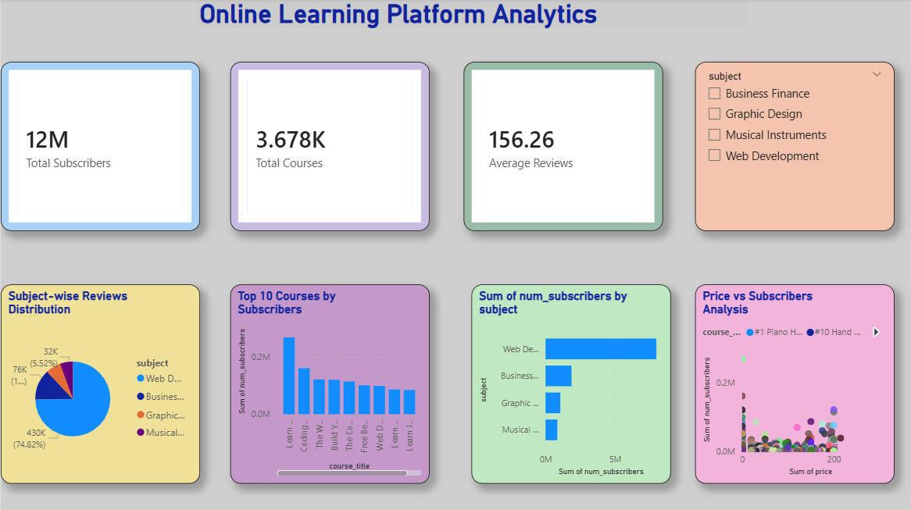

# 📊 Online Learning Platform Analytics Dashboard

## 📌 Project Overview
This project analyzes online learning platform data using Power BI.  
The dashboard provides insights into subscribers, courses, reviews, pricing, and subject-wise performance.

---

## ❓ Problem Statement
Understanding online course performance manually is difficult due to large amounts of educational data.

This dashboard helps to:
- Analyze subscriber trends
- Identify top-performing courses
- Compare subjects by popularity
- Study price vs subscriber relationship
- Understand review distribution

---

## 🛠 Tools Used

| Tool | Purpose |
|------|---------|
| Power BI | Dashboard Creation |
| Power Query | Data Cleaning |
| Excel/CSV | Dataset Preparation |

---

## 📂 Dataset Information

The project uses:
- raw_dataset.csv
- cleaned_dataset.csv

---

## 📈 Dashboard Features

- KPI Cards
- Subject-wise Subscriber Analysis
- Top 10 Courses by Subscribers
- Price vs Subscribers Scatter Plot
- Reviews Distribution Pie Chart
- Interactive Filters

---

## 🖼 Dashboard Preview

### Dashboard Page

---

## 👩‍💻 Developed By
Fathima